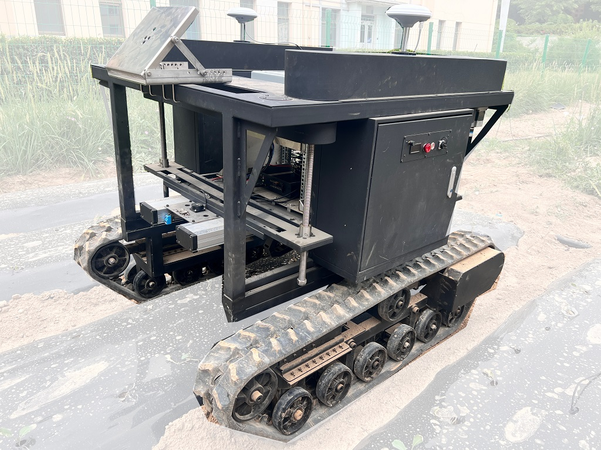

# ros_gt_msg

Pure control code for GT-02 @confidentFeng

Formated and commented by @JChrysanthemum

<!-- 浙江智澜 GT-02 全地形履带车 ROS控制源码  -->

**DO NOT** add your customed code, create your own package instead. 

------

Topic | Message | Comment
-----|-----|-----
/GT_Control | [GT_control.msg](msg/GT_control.msg) | Control movement by wheel speed or linear/anguar speed.
/Lift_Control | [Lift_control.msg](msg/Lift_control.msg)  | Move to loc or move with speed
/GT_Motion |  [GT_motion.msg](msg/GT_motion.msg) | Driver or register details, only for hardware debugging.
/Lift_Motion |  [Lift_state.msg](msg/Lift_state.msg) | Driver or register details, only for hardware debugging.

# FAQ
*What can this package do*
: Move GT-02 with two control mode and manipulate the platform

*How to move this*
: publish [GT_control.msg](msg/GT_control.msg) at `/GT_Control` topic, each command lives for 1 second.

*What about the lift platform*
: publish [Lift_control.msg](msg/Lift_control.msg) at `/Lift_Control` topic, each command lives for 1 second.

*Brief control flow*
: GT_control -> GT_motion -> VCI_USBCAN : Move and turn; Lift_control -> VCI_USBCAN : Lift platform

*More detail of parameters*
: You can find parameter configuration at the comment of [GT_control.msg](msg/GT_control.msg) and [Lift_control.msg](msg/Lift_control.msg). You can go further with [PDF Manual](doc/GT02_CAN_Communication_Protocol_V2.pdf) and [CPP Source Code](src/ros_gt_msg.cpp)

*Where is RTK and Navigation*
: They have little to do with future development, but you can find it at [GT-02 ENV files backup](https://github.com/JChrysanthemum/ros_gt_msg/releases/tag/env).

